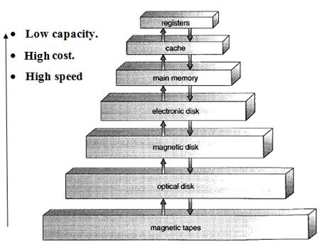

# Lecture 4 - 12th August 2022

* Memory management activities done by the OS for the system
* Storage and disc management activities done by the OS for the system

> **Caching**: caching is the process of copying data in memory with higher speed to speed up the access to the data. 

 

 

## DS used to make OS
* Lists
* Stack
* Queues
* Trees
* Graphs
* Bitmaps

> Multi-processor systems
* Graceful Degradation : Service depends on the available hardware
* Fault tolerant : Service level does not decrease

> Clustered Systems
* Storage-area network (SAN)

> Distributed Computing
* LAN, WAN, MAN

> Real-time embedded systems

> Peer to Peer Computing

> Virtual systems

> Cloud computing

## Operating system Interface
> User Interface for the operating system
* CLI
* GUI

> Facility to execute program

> I/O operations 

> File-system manipulation

> Communication
* Message passing
* Shared Memory

> Error detection